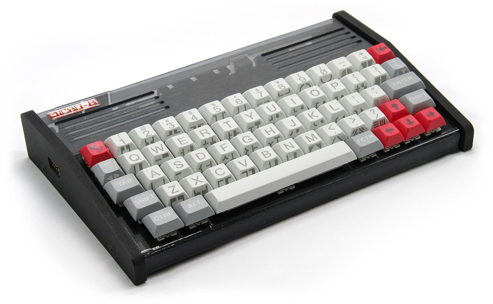

# Micro-8

Projects for the **Micro-8**, an 8-bit retro computer programmed in its own C-like language, **Lofi**.

- Micro-8: [www.micro-8.com](https://www.micro-8.com)
- The Micro-8 is © Franck Sauer
- Author : Benoit (BSM) Saint-Moulin, [www.bsm3d.com](https://www.bsm3d.com)

## The Micro-8 at a glance

| | |
|---|---|
| CPU | Atmel ATmega128 8-bit MCU at 15.34 MHz, Harvard architecture |
| Memory | 4 KiB internal SRAM + 256 KiB external SRAM (64 KiB visible at a time) |
| Custom chip | "MAGIC" FPGA: memory, audio, graphics and interface controllers |
| Video | 800x480 (WVGA) at 60 Hz, simultaneous analog (VGA) and digital outputs |
| Graphics | Text, bitmap, 16x16 tile and 32 hardware sprites (24x21) layers, 16-entry palettes from 512 colors |
| FM sound | Genuine Yamaha YM2612 (Sega Mega Drive/Genesis chip), 6 voices |
| Digital synth | Subtractive synth in the FPGA: waveforms, DPCM drum kit, resonant filter, envelopes, LFOs, 2 voices |
| I/O | MIDI IN/OUT, 2 serial game controller ports, PS/2 mouse, 8-bit user port, micro-SD (FAT32) |
| Software | Built-in OS and Lofi compiler, sprite/tile/sound editors |

## Projects

| Folder | Description |
|---|---|
| [`SidRush/`](SidRush) | **Sid Rush**, a C64-style music demo and cracktro, the first demo written for the Micro-8 |
| [`Tracker/`](Tracker) | **Micro-8 Tracker 0.1**, an 8-track pattern tracker, and a standalone player |

## Notes

- Source lines must stay below 159 characters (the machine's read limit) and files must use LF line endings.
- Precompiled `.BIN` files are compiled for **Micro-8 OS 0.8.0**. Other OS versions: recompile the source.
- Compile on the machine with `compile FILE.SRC`, then `run FILE.BIN`.
