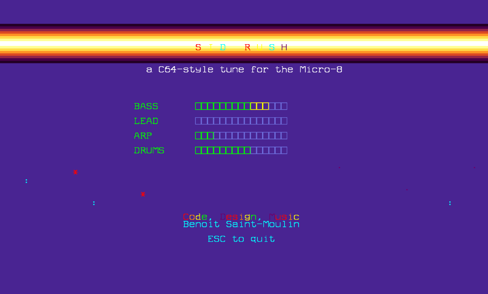

# Sid Rush

**Sid Rush** is a C64-style tune and cracktro, and the **first demo written for the Micro-8**.
Code, design and music by Benoit (BSM) Saint-Moulin, [www.bsm3d.com](https://www.bsm3d.com).

## The demo

- A raster "copper" bar with a rainbow title, a parallax starfield, and credits.
- Four live level meters (BASS, LEAD, ARP, DRUMS) driven by the notes being played.
- Press `ESC` to quit.

## The music

All four voices come from the machine's two sound circuits:

| Part | Hardware |
|---|---|
| Bass (gallop) | YM2612 FM voice 1, instrument `bass01.ins` |
| Lead (delayed vibrato) | YM2612 FM voice 2, instrument `lead02.ins` |
| Arpeggio | Digital synth voice 1, one chord note per video frame |
| Drums | Digital synth voice 0, DPCM kit |

The song is 17 bars played as 34 positions, 16 rows per bar at 6 frames per row, and loops.

## The code

`SIDRUSH.SRC` is a single Lofi file, generated from one data set that also produces the tracker project.

- **Main loop**: one iteration per frame, ended by `vSync()`. It advances the song every 6 frames, reads the bass, lead and drum patterns, and plays the arpeggio.
- **Arpeggio**: each frame plays the next chord tone with `synNoteOn`, then `synNoteOff(1)` just before `vSync()`. A fast release lets the pitch change with the gate closed, which avoids a tick on real hardware.
- **Drums**: the digital synth restarts an envelope or sample only on a rising trigger, so each hit is a note off followed by a note on.
- **Video**: raster-colored bar and title through palette copies, stars scrolling at different speeds, and meters redrawn from the last note velocities.

## Running it

1. Copy `SIDRUSH.BIN` (precompiled, **compiled for Micro-8 OS 0.8.0**) or `SIDRUSH.SRC` to the SD card. The FM instruments `bass01.ins` and `lead02.ins` are loaded from `/tools/sounded/sounds` (shipped with SOUNDED).
2. On the machine: `run sidrush.bin`, or `compile sidrush.src` first to rebuild it (e.g. on another OS version).

## Tracker project

`SIDRUSH.M8S` (with `.EXT.json` and `.NOTES.json` for Micro-8 Studio) is the same music as a tracker project: FM1 bass, FM2 lead, DRM drums, SYN arpeggio, 17 patterns, 34 song positions, tempo 150. Open it with the [Tracker](../Tracker) player. The demo itself does not need it.