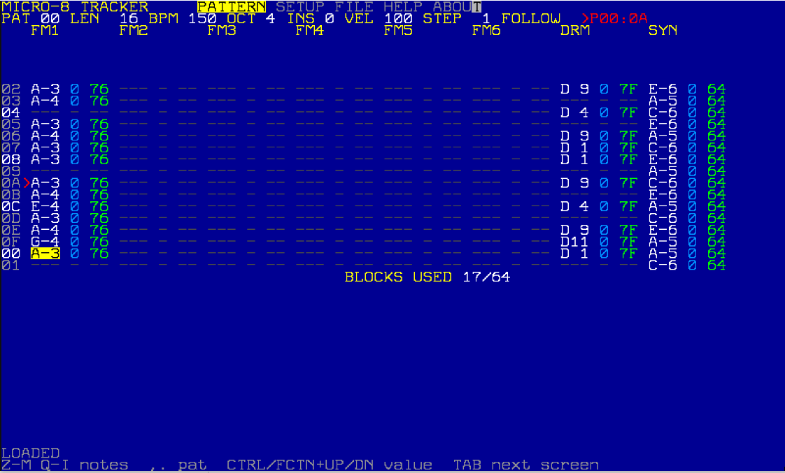
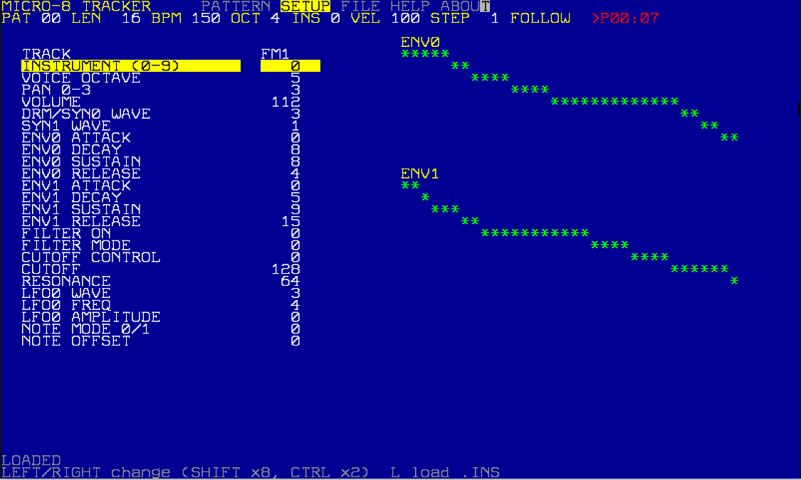
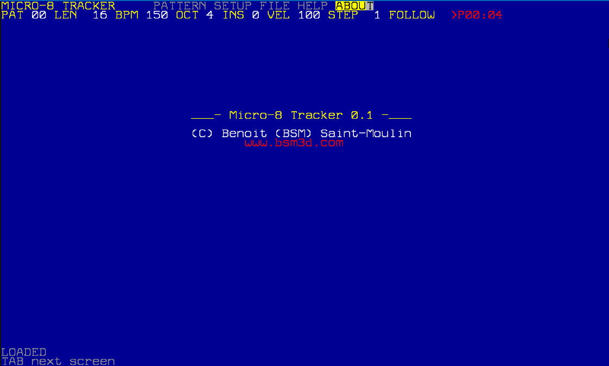

# Micro-8 Tracker 0.1

**MICRO-8 TRACKER 0.1**, by Benoit (BSM) Saint-Moulin, [www.bsm3d.com](https://www.bsm3d.com)

A pattern tracker for the Micro-8, written in Lofi.

**8 tracks: 6 FM voices (YM2612), 2 synths (drums and VA).**

## Screenshots

 

## Files

| File | Role |
|---|---|
| `TRACKER.SRC` | The tracker: 8 tracks, patterns of 16 to 256 steps looping (no song mode yet), screens PATTERN, SETUP, FILE, HELP and ABOUT |
| `TRACKER.BIN` | Precompiled `TRACKER.SRC`, **compiled for Micro-8 OS 0.8.0** (run it directly, or recompile the source on your OS version) |
| `PLAYER.SRC` | Standalone player, no editing: lists the `.M8S` projects of its folder and plays the chosen one. Small enough to copy into a game or demo |

## Tracks

| Track | Hardware voice | Use |
|---|---|---|
| FM1 to FM6 | YM2612 voices | Melodies, basses, chords; bank of 10 instruments |
| DRM | Digital synth voice 0 | Drums (20 DPCM sounds) or oscillator |
| SYN | Digital synth voice 1 | Oscillator (VA) or drums |

Both synth voices share a filter, two envelopes and an LFO (set on the SETUP screen).

## Getting started

1. Copy `TRACKER.SRC` and `PLAYER.SRC` to the SD card, for example in `/TOOLS/TRACKER`.
2. On the machine (OS 0.8.0): `cd /tools/tracker`, `compile tracker.src`, `run tracker.bin`. The 10 default FM instruments are loaded from `/tools/sounded/sounds`.
3. Notes follow MIDI numbers: note 69 on an octave-5 voice is A 440 Hz.
4. To play a project without the tracker: `compile player.src`, `run player.bin`, then pick the song from the list.

## Keys (PATTERN)

| Key | Action |
|---|---|
| arrows | Move the cursor (note, instrument, velocity, then next track) |
| `Z S X D C V G B H N J M` | Notes C to B of the current octave |
| `Q 2 W 3 E R 5 T 6 Y 7 U I` | Same notes one octave higher |
| `1` | Note off |
| `Backspace` | Clear the cell |
| `-` / `=` | Octave -/+ (velocity in the velocity field) |
| `[` / `]` | Default instrument -/+ |
| `;` / `'` | Default velocity -/+ |
| `,` / `.` | Previous / next pattern |
| `Space` | Play / stop the pattern (looping) |
| `9` / `0` | Tempo -/+ (40 to 255 BPM) |
| `TAB` | Next screen |
| `FCTN+Esc` | Quit |

On the DRM track, note keys pick one of the 20 drum sounds. On SETUP, `L` loads an `.INS` file into the track's slot and `S` saves the edited instrument. On FILE, `S` saves, `L` lists the `.M8S` songs of the folder (UP/DOWN choose, ENTER loads, ESC cancels), `R` renames and `N` starts a new project.

## Project files

A project is a single compressed `NAME.M8S` file: tracks are event lists, and a track already written elsewhere (even transposed) is a 4-byte reference, like the transposed patterns of Future Composer. Format: header `M8S1`, song data, FM instruments (54 parameters each), patterns, end marker `255`. The Sid Rush music (17 patterns, 34 song positions) takes 782 bytes.

The tracker, the player and Micro-8 Studio all read and write the same files.

## Notes from the real machine

- The digital synth restarts an envelope or DPCM sound only on a rising trigger, so the drum and SYN tracks send a note off before every note on.
- The machine's compiler shifts (`<<`, `>>`) only a `byte`, and API arguments must not be of a higher type than the manual's (use casts).
- `break` and `continue` do not release local variables declared in the loop: avoid them in nested loops.